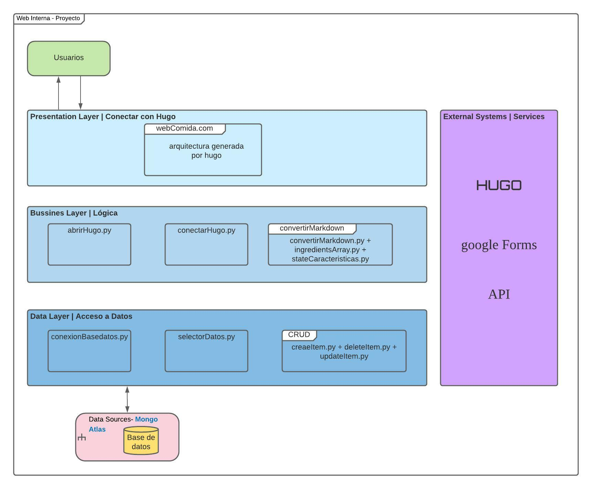
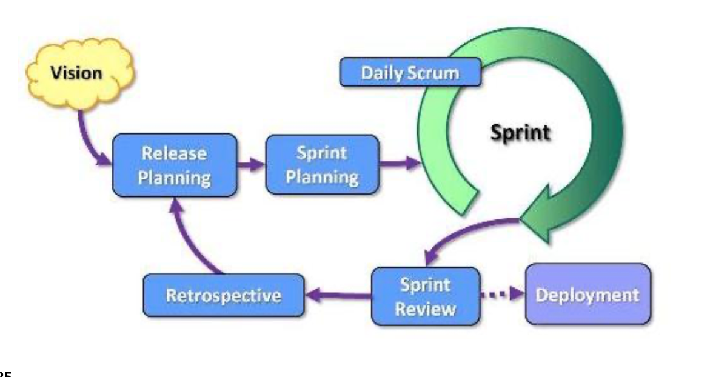
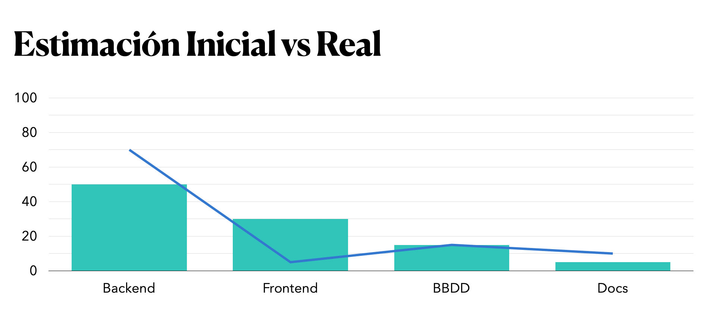

# **PROYECTO PYDEVOPS**
#### ***Ramón Sánchez & Leslie Aranibar***  *1r DAW DUAL* 
-------
***Índice:***

1. Introducción
   * Descripción del reto
   * Análisis de los objetivos   
2. Demostración del funcionamiento del proyecto
3. Descripción técnica
    * Arquitectura de la applicación
    * Tecnologías utilizadas 
    * Diagrama de compontes y sus funcionalidades
4. Metodología de desarrollo utilizada
5. Clockify del desarrollo de la app (esto lo haré  al final porque seguimos inputando)
   * Diagrama del trabajo hecho
   * Análisis y justificación del tiempo invertido
6. Conclusiones 
  * Principales dificultades encontradas
   * Posibles mejoras 
7. Turno de preguntas
---
## **1. Introducción**

**- Descripción del Reto:**  
El desafío que mi equipo abordó resolutivamente, en esencia, consiste en la refactorización de la web interna de una empresa determinada. La cuál era hecha con Wordpress y presentaba ciertas flaquezas. Sobretodo en los procesos de CRUD en su stock.

De manera que nosotros debemos de encargarnos de implementar un sistema de integración y entrega contínua (CI/CD) y mejorar, tanto el funcionamiento y la estética, de su web interna. Todo eso haciendo uso de los conocimientos adquiridos de Python, CSS y de BBDD.

Por suerte, el último becario pasó los ítems a documentos JSON. Y gracias a él, este es el punto de partida del trabajo de nuestro equipo.

**- Análisis de los objetivos:**

Los objetivos clave de este proyecto son:

1. Desarrollar una applicación Python para extraer los datos de MongoAtlas, diseñando una especificación del esquema de los  documentos JSON. 
   
2. Otra aplicación Python que transforme los documentos JSON en ficheros Markdown.
3. Una tercera aplicación Python que sitúe los ficheros MD en la estructura de directorios que establece el generador de contenidos estáticos HUGO
4. Personalizar los estilos CSS para que la empresa disponga de una web única y hermosa. 
5. Implementar las funcionalidades de CRUD. Para que cualquier cambio que la empresa realice sobre un ítem de la base de datos se actualice automátiamente en su web simplemente lanzando el sistema que hemos desarrollado. 
---
## **2. Demostración del funcionamiento del proyecto**

A continuación ejecutaremos nuestro programa des de el *main.py* para demostrar que cumple con todos los objetivos vistos préviamente. Y satisfae las necesidades que demandaba la empresa. 

---
## **3. Descripción técnica**

* **Arquitectura de la applicación:** 

La arquitectura del sistema de nuestra aplicación es modular. Cada módulo es independiente de los demás, de manera que presenta la lógica un bajo acoplamiento. Pero se encuentran todos conectados en el main.py y son ejecutados a la vez. 

Nuestras barricados las encontramos en los módulos dónde hemos utlizado las siguientes librerías: *Pymongo, Os, Shutill, Webbrowser y Certifi.* Ya que por algún error que se presente en ellas impedirá la ejecución de dichos módulos.

* **Tecnologías utilizadas:**

Para desarrollar el proyecto nosotros hemos hecho uso de las siguientes herramientas:
|      Herramientas     |                         Funcionalidad                         |
|:---------------------:|:-------------------------------------------------------------:|
| Visual Studio Code    | codificar                                                     |
| Linter en VSC         | visualizar errores                                            |
| Conventional Commits  | proporciona mas significado y legibilidad a los commits       |
| Git Hub               | para compartir y trabajar juntos                              |
| Git Graphs            | permite ver el historial y el esquema de las ramas de trabajo |
| Live Share            | codificar conjuntamente                                       |
| Black                 | corrector de la sintaxis de programación                      |                                                                                       |
| Hugo                  | gestor de sitios estáticos                                    |
| Python                | lenguaje de programación                                      |
| Mongo Atlas           | servicio global de base de datos de documentos en la nube     |
| Google Formularios    | para hacer formularios                                        |
| Discord y Whastapp              | conectarnos y hacer dailys                                    |

*   **Diagrama de compontes y sus funcionalidades:**

Nuestro diagrama de componentes consta de los siguientes módulos :

|          Módulo         |                                                                                                                              Proposito                                                                                                                              |
|:-----------------------:|:-------------------------------------------------------------------------------------------------------------------------------------------------------------------------------------------------------------------------------------------------------------------:|
| Main.py                 | Recoge y ejecuta todos los otros módulos, por lo tanto depende de los demás.                                                                                                                                                                                         |
| conexionBasedatos.py    | Conecta con la base de datos almacenada en MongoAtlas.                                                                                                                                                                                     |
| selectorDatos.py     | Divide los ítems según su categoria y crea una lista python para su posterior manipulación.                                                                                                                                                                                               |
| convertirMarkdown.py    | Transforma la lista de 9 diccionarios de la misma categoria en un solo archivo markdown, mediante dos funciones. Utiliza dos funciones más (selectorDatos y escritorMarkdown), con estas obtiene la lista con los 9 diccionarios pertenecientes a la misma categoria y los escribe todos en un mismo archivo MD.                                                                                                                                                                                                                                             |
| ingredientsArray.py     |   Transforma el array que le pasa el valor de *ingredients* y los transforma en un solo string, para su posterior manipulación para dar estilo cuando se escriban en los MD.                                                                                                                                                                                                                                                           |
| stateCaracteristicas.py |         Transforma el diccionario que le pasa el valor de *state* y los transforma en un solo string, para su posterior manipulación para dar estilo cuando se escriban en los MD.                                                                                                                                                                                                                                                                |
| conectarHugo.py         | Traslada los archivos que se encuentran en la carpeta origen a la ruta destino deseada. En este caso es en el Post>Content>webComida.com, para que el gestor  de sitios estáticos lo publique. Depende de los archivos Markdown convertidos creados por ese módulo. |
| abrirHugo.py            | Se posiciona dentro de la web con Hugo. Luego abre una ventana en el navegador  predeterminado de cada ordenador y ejecuta en la terminal el comando para ver la web.                                                                                               |
                                             
---
 ## **4. Metodología de desarrollo utilizada**
La metodología de desarrollo que hemos seleccionado conjuntamente es la SCRUM. Porque nos desenvolvemos bien dentro de este marco de proceso ligero y ágil. 

Este modelo intenta construir un mejor enfoque para manejar el desarrollo de software. Tiene una menos documentación que los otros métodos tradicionales y esto hace que sea menos complicado. Consta de un programa corto y fijo por ciclos con alcance ajustable, llamados sprints. Y cuenta con eventos, hitos y reuniones que se repiten.

El *Product owner* es David (tutor), el rol del *Scrum Master* nos lo hemos ido relevando, de un sprint a otro. Y el*Scrum team* somos nosotros: Ramón y Leslie.

Y para la organización del trabajo y potenciar nuestra productividad hemos utilizado la herramienta *Notion*. Gracias a esta herramienta hemos definido todo el backlog junto con sus historias de usuario correspondientes. Además hemos organizado el desarrollo del trabajo en 5 sprints con objetivos específicos, mesurables, alcanzables, relevantes y temporales, de acuerdo con el principio *SMART*. 
Por  otra parte, con la finalidad de llevar un ritmo de trabajo sincronizado, contamos con un calendario compartido dónde se visualiza la vida temporal de los *Epics* y algunas fechas destacables (como los *Sprint review meeting, Scrum retrospective meeting, etc.*)

Una pestaña que nos fué muy útil es la de *Task by Status*, la cual nos permitía ver el estado de las tareas de los sprints. Dividimos las tareas en 4  columnas: 
*  *Not started*: tareas por hacer
*  *In progress*: tareas que se estan haciendo.
*  *Completed*: tareas finalizadas
*  *Bugs:* tareas que tienen problemas o errores que hay que arreglar

De esta manera, la comunicación entre nosotros ha sido múy ágil, entendible y fluída. Y la diferencia horaria de trabajo que cada uno tiene no supuso ningún problema.

A continuación os mostraremos el 
[Notion del proyecto](https://efficient-governor-1bf.notion.site/dfb1bb2e4d4344e0979f03268fdf8333?v=8160853a846449f9add5f290d6cdfbd5)

---
## **5. Clockify del desarrollo de la app**
* *Diagrama del trabajo hecho:*
  [Clockify Report del proyecto](https://github.com/ramonsancheez/Project-Py_Devops/blob/Leslie-features2/srcReadme/Clockify_por_Tags.pdf)

Este es nuestro diagrama de trabajo que hemos hecho con Clockify. Dentro de ese informe podemos ver en primer lugar una diagrama en barras que muestra la horas de trabajo que hemos hecho a lo largo del proyecto.

 Después, a través de una diagramas circular podemos  visualizar el porcentaje de horas que cada progrmador ha invertido en el proyecto. En nuestro caso, vemos que ambos hemos invertido el mismo esfuerzo. 

También existe otro diagrama cirular donde se muestra por distintos colores las tareas que hemos realizado. Y por último se ve de manera más detallada, separado por programador, las tareas realizadas. 

* *Análisis y justificación del tiempo invertido*:
* *Diagrama del tiempo:*
  [Clockify Time del proyecto](https://github.com/ramonsancheez/Project-Py_Devops/blob/Leslie-features2/srcReadme/Clockify_Time_Report_Summary_18_11_2021-13_12_2021.pdf)
  
Analizando el tiempo invertido, principalmente podemos destacar que nos hemos acercado a la estimación inicial. Desde un principio, a través de la experiencia que tuvo nuestro mentor de 2n año, sabíamos que alredor de más de 100h le íbamos a dedicar.
Por eso, decidimos ser precabidos y empezar a trabajar y organizar los sprints desde el primer momento. 

Esta estrategia nos ha sido muy fructífera ya que no nos hemos visto tan desbordados o con mucho trabajo para hacer a último momento, como ha pasado en otras parejas. 

Igualmente, hemos acabado trabajando más de lo que pensábamos. El primer factor causante ha sido por la curva de aprendizaje para aprender el funcionamiento y familiarizarnos con sus comportamientos de determinadas herramientas o tecnologías. Sobretodo lo tuvimos con Git, Hugo, Mongo, TDD y ciertas librerías más.

Otro resultado diferente que obtuvimos de nuestra valoración inicial fue con la dedicación en cada módulo. 

El *Backlog* de nuestro proyecto lo hemos divido en 4 *Epics*: 
1. Backend
2. Frontend
3. Base de datos
4. Documentación

Desde el génesis del proyecto predecimos que el bloque de **Backend** se necesitaría más esfuerzo que en los otros. Por eso, hemos decidido atacar este bloque primero. Sin embargo, al final no fuimos tan certeros  y trabajamos más de lo estimado. La lógica de Python, implementar TDD y algunos errores procedentes de algunas librerias (como el requerimiento de certificados o su descarga incorrecta), fueron algunos baches que nos hemos encontrado.

Con la **Base de datos,** también nos paso algo similar. Puesto que no contábamos con un profesor en esa asignatura al principio del curso, la razón por la cuál nos excedimos de tiempo fue que en nuestra estimación solo tuvimos en cuenta la duración de los cursos del *Mongo Academy*. Y no le hemos sumado un pequeño margen de tiempo para el procesamiento de la información, ya que no todos los proceso del *CRUD* quedaron consolidados a la primera. Como también, otro margen para resolución de posibles errore y margen de maniobra.

También habíamos subestimado la duración de la **Documentación**. Esto es debido a que habíamos tomado el README del estudiante de 2n como referente. En contraste con el suyo, nuestro guión de la documentación es mas completo y por lo tanto más profesional. Ya que incluye un abanico de apartados diferentes para analizar, documentar, justificar y aportar gráficos.

En cambio en **Frontend** el tiempo real dedicado ha sido mucho menos al estimado, ya que una vez comprendimos el funcinamiento de *Hugo*, con las plantillas la personalización de la hoja de estilos CSS es muy sencilla.

Como hemos seguido la metodología *SCRUM* nos ha permitido siempre hacer cambios ágiles y adaptarnos siempre a los obstátuculos venideros que nos hemos ido encontrando en estea viaje de aprendizaje. 

A continuación, mediante un gráfico combinado, vemos representado en barras la estimación inicial de horas que pensábamos dedicar en esos epics, en relación a la totalidad del proyecto. Luego, en forma linear podemos comparar la parte proporcional de las horas invertidas que hemos dedicado a cada bloque. 

Como al final resultaron ser más de 100 horas de trabajo, para poder visiualizar mejor la comparación decidimos utlizar un diagrama combinado en el se representen la parte proporcional del tiempo total invertido. 

---
## **6. Conclusiones**
* *Principales dificultades encontradas:*
  
Las principales dificultades que nos hemos encontrado fue familiarizarnos y trabajar con la estrategia de Git Flow y funcioanlidades de Git ya que tuvimos conflictos de ramas.
Otro factor a tener en cuenta es el tiempo ajustado que hemos dispuesto, la integación de nuevas funcionalidades sorpresas (los formularios) y la integración/planteamiento de casos tests en el código.

* *Posibles mejoras:*

Hemos llegado a la conclusión que para llegar a ser mejores programadores y programadoras, leer más libros sobre buenas prácticas en programación, como *The code complete o Clean Arquitecture*, nos darán muchos beneficios. Nos leímos una parte de *The Clean arquitecture* y parece interesante. También aprender más sobre estrategias de *Git flow*. Y leer más el libro de Python y practicar, sobretodo. Durante estas fechas festivas nos seguiremos manteniendo ocupados. 

---
## **7.Turno de preguntas**

